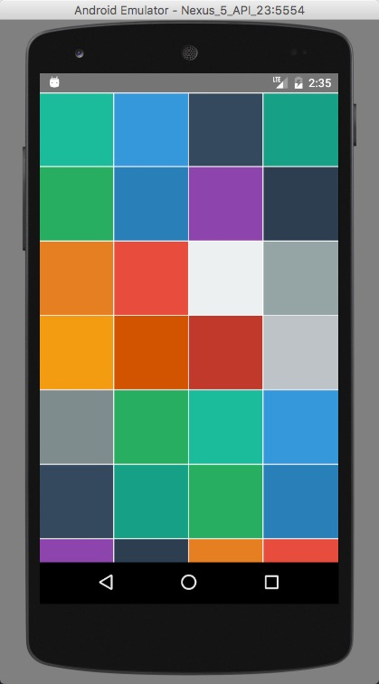
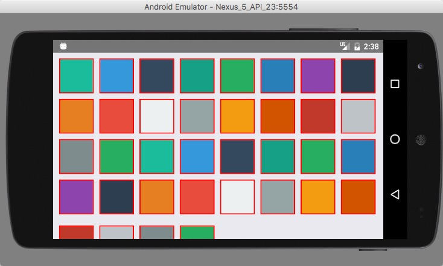
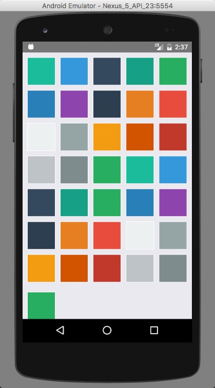

# react-native-flex-grid-view

[](https://www.npmjs.com/package/react-native-flex-grid-view)

简单的 react native 布局。

Easy Grid View for React Native.





## Installation

```
npm install react-native-flex-grid-view
```

## example

```
import GridView from 'react-native-flex-grid-view'

<GridView
  data={[
    '#1abc9c', '#3498db', '#34495e', '#16a085', '#27ae60', '#2980b9',
    '#8e44ad', '#2c3e50', '#e67e22', '#e74c3c', '#ecf0f1', '#95a5a6',
    '#f39c12', '#d35400', '#c0392b', '#bdc3c7', '#7f8c8d', '#27ae60',
    '#1abc9c', '#3498db', '#34495e', '#16a085', '#27ae60', '#2980b9',
    '#8e44ad', '#2c3e50', '#e67e22', '#e74c3c', '#ecf0f1', '#95a5a6',
    '#f39c12', '#d35400', '#c0392b', '#bdc3c7', '#7f8c8d', '#27ae60',
  ]}
  span={4}
  border={1}
  borderColor="white"
  spacing={0}
  square
  flat
  render={item => <View style={{ backgroundColor: item, flex: 1 }} />}
/>
```

## API

| Property | Type | Default Value | Description |
|:----:|:----:|:----:|:----:|
|data|Array|[]|将要被渲染的数据(Items to be rendered)|
|span|Number|1|每行的个数(each row num)
|render|Function|() => {}|传入data内每个对象，返回组件(render each object in data, return a component)|
|spacing|Number|0|间距(Spacing between each item)|
|border|Number|0|边宽(border width)|
|borderColor|String|'black'|边框的颜色(border color)|
|square|Boolean|false|是否保持正方形(true: is a square)|
|flat|Boolean|true|是否采用 **FlatList** 或着 纯粹布局(true: use **FlatList**, false: only View Grid)